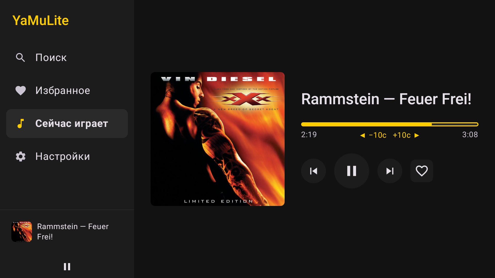
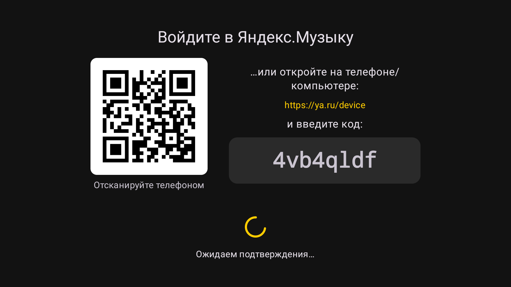
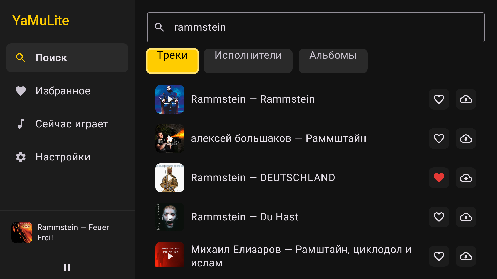
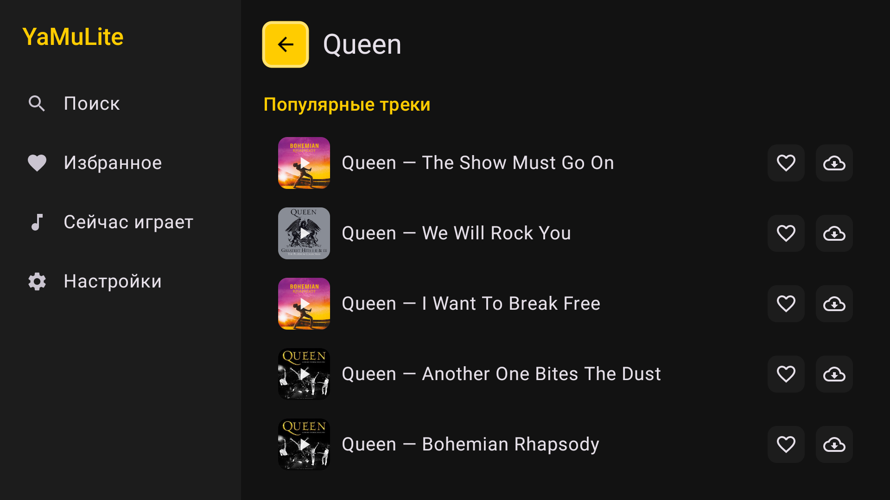
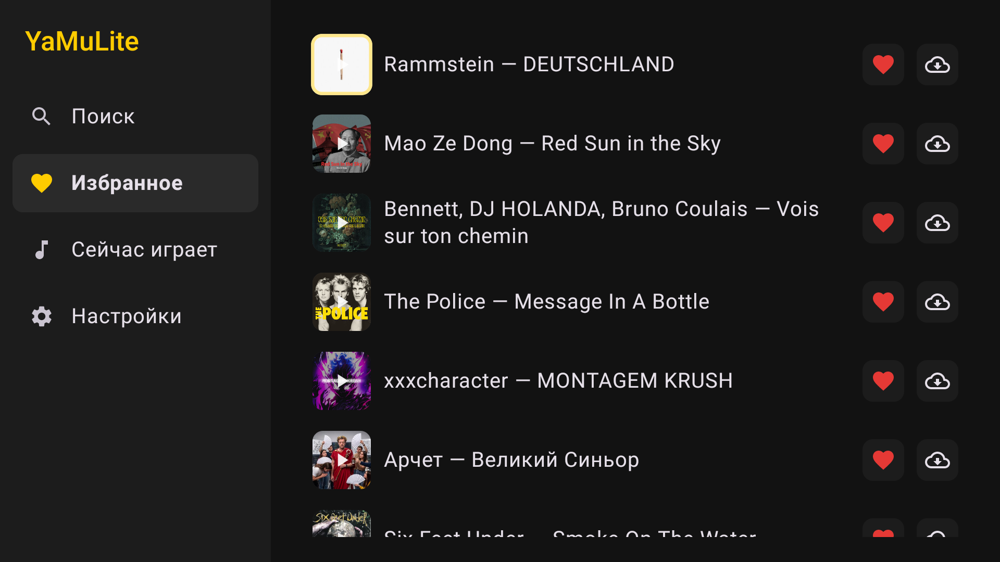
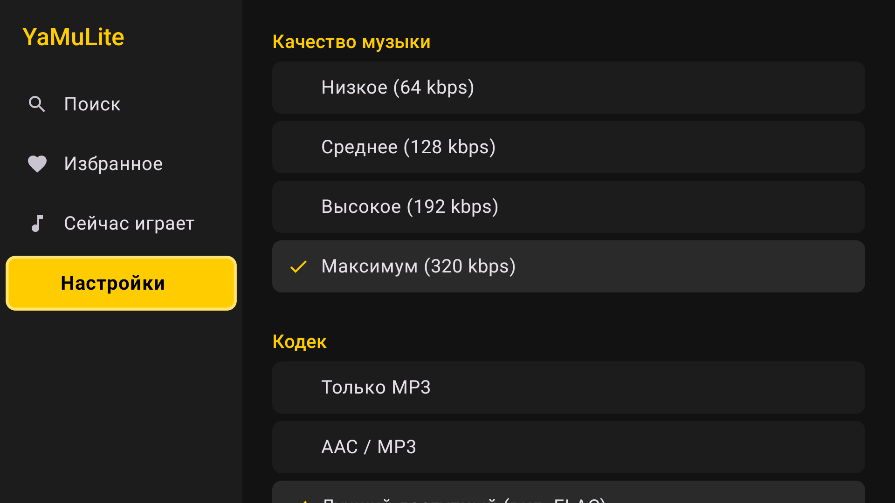

# YaMuLite TV

An unofficial Android TV client for Yandex Music, built for remote-control-only devices like the
**Dune HD Solo 8K**. Ports the data layer (auth, streaming, downloads, background playback) from
the [phone client](https://github.com/dpronyaev/yamulite-android) and replaces every screen with a
D-pad-first UI: no touch input is assumed anywhere.

<p align="center">
  
</p>

## Screenshots

| Sign-in (QR code) | Search |
|:--:|:--:|
|  |  |

| Artist | Favorites |
|:--:|:--:|
|  |  |

| Settings |
|:--:|
|  |

## Remote-control UX

- **Loud focus.** Every interactive element scales up, gets a bright border and swaps to the
  accent color when it has D-pad focus (`ui/tv/TvSurface`) — the default Compose ripple is easy to
  miss on a 10-foot display.
- **No dead ends.** A track row exposes three independent focus stops (cover = play, heart = like,
  cloud = download) instead of one focusable row containing more focusables, which Compose's 2D
  focus search can't reach with a D-pad. The search box explicitly hands focus to the active tab on
  `DOWN` instead of relying on ambiguous geometric search among three same-row candidates.
- **D-pad seek.** Now Playing has no draggable slider (nothing to drag with a remote); the seek bar
  is a focusable control that jumps ±10s on `LEFT`/`RIGHT`.
- **QR sign-in.** The OAuth device-flow screen renders the verification URL as a QR code, so signing
  in means scanning with a phone instead of typing a URL with a D-pad.
- **Media keys just work.** Play/pause/next/previous on the physical remote route through Android's
  `MediaSession` to `PlaybackService` regardless of which screen is focused — no custom key handling
  needed.
- **Persistent mini-player.** The left nav rail shows the current track and a play/pause toggle
  under the four tabs, so playback control doesn't require leaving whatever screen you're on.

## Tech stack

Same as the phone app — Kotlin 2.0.21, Jetpack Compose, Hilt, Retrofit + OkHttp + kotlinx.serialization,
Coil 3, Media3 ExoPlayer with a `MediaSessionService` for background playback, DataStore, WorkManager
for downloads. Added: `com.google.zxing:core` for QR generation. No `androidx.tv` library — the focus
system in `ui/tv/TvFocus.kt` is hand-rolled on top of plain Compose Foundation (`focusable` +
`onFocusChanged` + `clickable`), which already fires on `DPAD_CENTER`/`Enter` once a node has focus.

`compileSdk = 36`, `targetSdk = 36`, `minSdk = 26`.

## Version

`versionCode` / `versionName` live in `app/build.gradle.kts` (`defaultConfig`) and drive the output
APK's filename via the `androidComponents.onVariants` block — every build is named
`yamulite-tv-<versionName>-<variant>.apk`, so an APK's filename always tells you what it is without
opening it. Bump both before cutting a release; `versionCode` must strictly increase for Android to
accept an upgrade install over an existing one.

Current version: **0.1.0** (versionCode 1).

## Download

A pre-built **release** APK for the current version is kept in
[`apk/yamulite-tv-0.1.0.apk`](apk/yamulite-tv-0.1.0.apk) — see [Performance](#performance) for why
release, not debug:

```bash
adb connect <device-ip>:5555   # e.g. a Dune HD Solo 8K on the same network
adb install -r apk/yamulite-tv-0.1.0.apk
adb shell am start -n dev.pdv.yamulite.tv/.MainActivity
```

## Build & install

```bash
export JAVA_HOME=/opt/homebrew/opt/openjdk@17/libexec/openjdk.jdk/Contents/Home
./gradlew :app:assembleRelease    # or :app:assembleDebug while developing

adb connect <device-ip>:5555
adb install -r app/build/outputs/apk/release/yamulite-tv-*-release.apk
adb shell am start -n dev.pdv.yamulite.tv/.MainActivity
```

`local.properties` must contain `sdk.dir=...`. After bumping the version and rebuilding, copy the
new release APK into `apk/` (dropping the `-release` suffix) and update this README's version
references.

## Performance

The release build type is signed with the debug key (see `app/build.gradle.kts`) specifically so
`assembleRelease` produces something installable straight over adb for testing on real hardware —
swap in a real keystore only if this ever needs to go through a store. Three things were verified
to matter for perceived performance on the Dune's weak 32-bit CPU, none of which change any
behavior a user can see:

- **Ship release, not debug.** A `debug` build has `android:debuggable="true"`, which disables ART
  runtime optimizations for the whole app — invisible in day-to-day development, but measurably
  slower than the exact same code once actually released. Release also applies R8 shrinking:
  **23.6 MB → 2.8 MB** for this app, which means faster install and a smaller footprint to
  dex-load and verify at cold start. `proguard-rules.pro` already carries the keep rules this
  needs for Hilt / Retrofit / kotlinx.serialization, ported from the phone app.
- **Recomposition scope.** `AudioPlayer` publishes playback position every 500ms while something is
  playing. `MainScreen` used to collect that `StateFlow` directly to feed the mini-player, which
  meant the *entire* screen scaffold (all 4 nav rail items, the `NavHost`'s wrapping `Box`)
  recomposed twice a second for as long as music played, everywhere in the app. Moved into its own
  `MiniPlayerSection` composable (`ui/main/MainScreen.kt`) that owns the collection and narrows it
  through `derivedStateOf` to just `(track, isPlaying)`, so only that small subtree re-executes,
  and only when the track or play state actually changes — not on every position tick.
- **Off-main-thread QR generation.** Encoding the OAuth QR code (`ui/tv/QrCode.kt`) fills a
  480×480 bitmap pixel by pixel; on this hardware that's enough to drop a frame if done inline
  during composition. Moved to `produceState` + `Dispatchers.Default`; the sign-in screen already
  rendered nothing for that slot until the bitmap was ready, so the only change is timing, not
  appearance.

## Debugging on a TV device

TVs often sleep between test runs — `screencap` returns a solid black image when the display is
off, which looks like a crash but isn't:

```bash
adb shell dumpsys power | grep -iE "mWakefulness|Display Power"   # check for Asleep / OFF
adb shell input keyevent KEYCODE_WAKEUP                            # wake it up
```

D-pad input can be driven straight from adb for UI testing without a physical remote:

```bash
adb shell input keyevent KEYCODE_DPAD_DOWN
adb shell input keyevent KEYCODE_DPAD_CENTER
adb shell input text "search query"   # types into whatever field currently has focus
```

## Architecture notes

- **Package:** `dev.pdv.yamulite.tv`, separate `applicationId` from the phone app so both can be
  installed side by side.
- **`data/`, `di/`** are a near-verbatim port of the phone app's data layer (OAuth device flow,
  Yandex Music API client, `AudioPlayer` + `PlaybackService` + `DownloadManager`), since none of it
  is UI-framework-specific.
- **`ui/tv/TvFocus.kt`** is the one file every screen depends on: `TvSurface` is the base focusable
  building block, and `FocusRequester.requestOnce()` sets initial focus per screen so the user never
  has to hunt for where the D-pad landed.
- **`ui/main/MainScreen.kt`** hosts a permanent left-side nav rail (Search / Favorites / Now Playing
  / Settings) instead of the phone app's bottom navigation bar, since a bottom bar sits awkwardly
  with D-pad up/down traversal.
- Screens the phone app didn't need to rethink at all (data layer, ViewModels) were copied with only
  the package renamed; every `ui/` screen was rewritten for focus-driven navigation.

## Known limitations

Same as the phone app (see the [upstream README](https://github.com/dpronyaev/yamulite-android)):
unofficial API, FLAC requires a FLAC-entitled subscription, no queue reordering.
